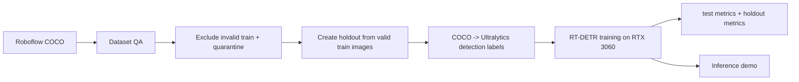

# AutoML Pressure Gauge Object Detection


Цель проекта - обучить воспроизводимый Object Detection pipeline для стрелочных манометров, который может использоваться как модуль автоматической поверки и калибровки. Модель RT-DETR находит элементы `base`, `maximum`, `minimum`, `tip`; по этим объектам следующий модуль может вычислять положение стрелки, сравнивать показание с эталонным значением и фиксировать отклонение прибора.

GitHub repository: [https://github.com/drozdyukov/auto_ml_pressure_gauge](https://github.com/drozdyukov/auto_ml_pressure_gauge)

## Бизнес-задача

В промышленнсти стрелочные манометры регулярно проходят поверку и калибровку: фактическое показание прибора сравнивается с эталонным давлением, после чего принимается решение о пригодности прибора. Ручная поверка занимает время, зависит от оператора, угла съемки, освещения и качества визуального считывания.

Бизнес-задача проекта - автоматизировать визуальный этап поверки и калибровки манометров. Модель должна надежно находить на изображении элементы шкалы и стрелки, чтобы последующий расчетный модуль мог определить показание, сравнить его с эталоном, посчитать погрешность и сформировать результат проверки.

Практический результат проекта:

- подготовленный pipeline для контроля качества датасета и обучения модели;
- обученная RT-DETR модель для Object Detection;
- воспроизводимые метрики на `test` и internal holdout;
- Docker-сценарий для запуска на машине с RTX 3060;
- inference-demo с изображениями и JSON-предсказаниями;
- базовый CV-модуль для будущей системы автоматической поверки и калибровки манометров.

## Данные

Датасет экспортирован из Roboflow в формате COCO Object Detection и импортируется из архива [guage_read.v1i.coco.zip](C:/Users/drozd/Downloads/guage_read.v1i.coco.zip) в [data/guage_read_coco](C:/Users/drozd/Documents/auto_ml_pressure_gauge/data/guage_read_coco).

Ожидаемые классы:

```text
base, maximum, minimum, tip
```

Текущий Roboflow export:

| Split | Images | Annotations |
| --- | ---: | ---: |
| train | 12489 | 50512 |
| valid | 3591 | 14519 |
| test | 1794 | 7232 |

Важно: internal holdout выбирается из `train`, затем исключается из обучения. Это не внешний тестовый датасет, а внутренняя независимая проверка.

## Pipeline



## ETL

ETL в проекте реализован как отдельный воспроизводимый этап подготовки данных:

- Extract: исходный датасет экспортируется из Roboflow в формате COCO Object Detection и распаковывается в `data/guage_read_coco`.
- Transform: выполняется Dataset QA, исключаются невалидные `train`-изображения, создается quarantine, выбирается deterministic holdout из валидного `train`, COCO-аннотации преобразуются в Ultralytics detection labels.
- Load: подготовленные изображения, `.txt` labels, `data.yaml` и `holdout_data.yaml` сохраняются в `data/gauge_rtdetr_detection` и затем используются командами `train`, `evaluate`, `infer-demo`.

Такой подход отделяет сырые данные от подготовленного датасета: исходный Roboflow export остается неизменным, а обучение всегда идет из проверенного prepared dataset.

## Dataset QA

Команда проверки:

```powershell
python -m pressure_gauge_ml.cli --config configs/train.yaml validate-data
```

Проверяется:

- есть ли файл изображения для каждой COCO-записи;
- есть ли аннотации у изображения;
- содержит ли изображение все классы `base`, `maximum`, `minimum`, `tip`;
- нет ли неизвестных классов;
- не выходят ли bbox за границы изображения;
- нет ли битых изображений;
- нет ли annotation, которые ссылаются на отсутствующее изображение.

Политика качества:

- `train`: невалидные изображения автоматически исключаются из prepared dataset;
- `valid/test`: невалидные изображения приводят к ошибке проверки, чтобы метрики не становились нечестными;
- проблемные `train`-изображения копируются в `reports/quarantine/train`;
- отчеты сохраняются в `reports/dataset_quality_report.json` и `reports/dataset_quality_report.csv`.

## Подготовка датасета

```powershell
python -m pressure_gauge_ml.cli --config configs/train.yaml prepare
```

Команда создает:

```text
data/gauge_rtdetr_detection/data.yaml
data/gauge_rtdetr_detection/holdout_data.yaml
data/gauge_rtdetr_detection/images/train
data/gauge_rtdetr_detection/images/valid
data/gauge_rtdetr_detection/images/test
data/gauge_rtdetr_detection/images/holdout
data/gauge_rtdetr_detection/labels/*
reports/holdout_manifest.json
```

Формат label-файла Ultralytics detection:

```text
class x_center y_center width height
```

## Модель и обучение

Основная модель: `rtdetr-l.pt` через Ultralytics.

## ML-архитектура

Архитектура решения состоит из четырех уровней:

- Data layer: Roboflow COCO export, QA-отчеты, quarantine и prepared Ultralytics dataset.
- Training layer: Ultralytics RT-DETR-L, transfer learning из `rtdetr-l.pt`, безопасные аугментации и автоматический расчет метрик после каждого запуска.
- Experiment layer: отдельная папка на каждый run, `training_config.yaml`, `run_manifest.json`, веса `best.pt`/`last.pt`, графики Ultralytics и JSON-метрики.
- Inference layer: загрузка `best.pt`, прогон новых изображений, сохранение размеченных изображений и `holdout_predictions.json` с `image`, `class`, `confidence`, `bbox_xyxy`.

RT-DETR выбран как современная transformer-based detector architecture для object detection. В отличие от старого варианта с keypoints/YOLO-pose, текущая постановка решает задачу обнаружения объектов: каждый элемент манометра размечен bounding box, а не точкой скелета.

Настройки в [configs/train.yaml](C:/Users/drozd/Documents/auto_ml_pressure_gauge/configs/train.yaml):

- `imgsz: 640`;
- `batch: 4`;
- `epochs: 50`;
- `device: 0`;
- `amp: true`;
- `expected_gpu: NVIDIA GeForce RTX 3060`;
- `holdout_count: 10`.
- безопасные аугментации: `degrees: 3.0`, `scale: 0.15`, `hsv_v: 0.2`, без `flipud`, `mosaic`, `mixup`.

Запуск:

```powershell
.\scripts\train_rtx3060.ps1
```

Дефолтный конфиг остается в `configs/train.yaml`, но ключевые параметры можно переопределять из CLI:

```powershell
python -m pressure_gauge_ml.cli --config configs/train.yaml `
  --dataset-root data/another_coco_export `
  --prepared-root data/another_rtdetr_prepared `
  --train-model rtdetr-l.pt `
  --epochs 20 `
  --batch 2 `
  --name experiment_another_dataset `
  train
```

`--train-model` задает архитектуру/стартовые веса для обучения. Для `evaluate`, `infer` и `infer-demo` флаг `--model` по-прежнему означает путь к готовым весам `best.pt`.

Аугментации можно точечно переопределить:

```powershell
python -m pressure_gauge_ml.cli --config configs/train.yaml `
  --degrees 5 `
  --scale 0.25 `
  --hsv-v 0.15 `
  --mosaic 0 `
  train
```

Каждый запуск получает имя с датой/временем и сохраняет:

- `weights/best.pt`;
- `weights/last.pt`;
- `training_config.yaml`;
- `data.yaml`;
- `holdout_data.yaml`;
- `classes.json`;
- `run_manifest.json`;
- `test_metrics.json`;
- `holdout_metrics.json`;
- стандартные Ultralytics-метрики и графики.

После успешного обучения метрики автоматически считаются на `test` и internal holdout, сохраняются в папке запуска и копируются в `reports/test_metrics.json` и `reports/holdout_metrics.json`.

## AutoML в проекте

В проекте используется автоматизация отдельных элементов ML-пайплайна вокруг выбранной кастомной модели RT-DETR.

Автоматизированы следующие шаги:

- проверка качества датасета перед обучением;
- исключение плохих `train`-изображений и сохранение quarantine;
- создание internal holdout;
- конвертация COCO в Ultralytics labels;
- запуск обучения с CLI overrides для датасета, модели, batch, epochs, run name и аугментаций;
- дообучение через `finetune --model <best.pt>`;
- автоматический расчет `test` и `holdout` метрик после `train`/`finetune`;
- сохранение артефактов запуска, конфигов, весов, метрик и визуализаций;
- inference-demo для проверки модели на новых изображениях.

За счет этого новый эксперимент можно запустить одной командой, а результаты будут сохранены в одинаковой структуре и пригодны для сравнения.

## Текущий обученный запуск

Полный запуск RT-DETR-L на RTX 3060 успешно завершился:

```text
runs/rtdetr/gauge_rtdetr_l_rtx3060_20260527_024713
```

Готовые веса:

```text
runs/rtdetr/gauge_rtdetr_l_rtx3060_20260527_024713/weights/best.pt
runs/rtdetr/gauge_rtdetr_l_rtx3060_20260527_024713/weights/last.pt
```

Метрики на `test`:

| Metric | Value |
| --- | ---: |
| precision | 0.9767 |
| recall | 0.9762 |
| mAP50 | 0.9795 |
| mAP50-95 | 0.8355 |

Метрики на internal holdout:

| Metric | Value |
| --- | ---: |
| precision | 0.9917 |
| recall | 1.0000 |
| mAP50 | 0.9950 |
| mAP50-95 | 0.9083 |

Файлы с итоговыми метриками продублированы в `reports/test_metrics.json` и `reports/holdout_metrics.json`.

Визуализации текущего запуска:

```text
runs/rtdetr/gauge_rtdetr_l_rtx3060_20260527_024713/results.png
runs/rtdetr/gauge_rtdetr_l_rtx3060_20260527_024713/confusion_matrix.png
runs/rtdetr/gauge_rtdetr_l_rtx3060_20260527_024713/BoxPR_curve.png
runs/rtdetr/gauge_rtdetr_l_rtx3060_20260527_024713/val_batch0_pred.jpg
```

Эти файлы используются как доказательные графики обучения, confusion matrix и примеры визуальных предсказаний модели.

## Дообучение

Дообучение стартует с уже обученного checkpoint `.pt` и создает новый запуск и новые метрики:

```powershell
.\scripts\finetune.ps1 `
  -ModelPath runs\rtdetr\<run_name>\weights\best.pt `
  -DatasetRoot data\new_coco_export `
  -PreparedRoot data\new_rtdetr_prepared `
  -Epochs 20 `
  -Batch 4 `
  -Name finetune_new_camera
```

То же через CLI:

```powershell
python -m pressure_gauge_ml.cli --config configs/train.yaml `
  --dataset-root data\new_coco_export `
  --prepared-root data\new_rtdetr_prepared `
  --epochs 20 `
  --batch 4 `
  --name finetune_new_camera `
  finetune --model runs\rtdetr\<run_name>\weights\best.pt
```

В `run_manifest.json` сохраняются `run_type: finetune`, `source_model`, параметры датасета, аугментаций и итоговые метрики.

## Оценка и inference-demo

Оценка на `test`:

```powershell
.\scripts\evaluate.ps1 -ModelPath runs\rtdetr\<run_name>\weights\best.pt
```

Оценка на internal holdout:

```powershell
.\scripts\evaluate_holdout.ps1 -ModelPath runs\rtdetr\<run_name>\weights\best.pt
```

Inference demo на holdout:

```powershell
.\scripts\infer_holdout_demo.ps1 -ModelPath runs\rtdetr\<run_name>\weights\best.pt
```

Результаты:

```text
reports/test_metrics.json
reports/holdout_metrics.json
reports/holdout_predictions.json
runs/predict/holdout_demo
```

`holdout_predictions.json` содержит `image`, `class`, `confidence`, `bbox_xyxy`.

## Docker

Dockerfile использует CUDA runtime и устанавливает проект в контейнере. Для GPU-запуска нужны Docker Desktop, WSL2 и NVIDIA Container Toolkit/поддержка `--gpus all`.

Текущий Dockerfile:

```dockerfile
FROM nvidia/cuda:12.1.1-cudnn8-runtime-ubuntu22.04

ENV PYTHONDONTWRITEBYTECODE=1 \
    PYTHONUNBUFFERED=1 \
    PIP_NO_CACHE_DIR=1

WORKDIR /app

RUN apt-get update \
    && apt-get install -y --no-install-recommends python3 python3-pip git libglib2.0-0 libgl1 \
    && rm -rf /var/lib/apt/lists/*

COPY pyproject.toml README.md ./
COPY src ./src
COPY configs ./configs
COPY scripts ./scripts
COPY tests ./tests

RUN python3 -m pip install --upgrade pip \
    && python3 -m pip install ".[dev]"

CMD ["python3", "-m", "pressure_gauge_ml.cli", "summary"]
```

Роль контейнеризации:

- одинаковое окружение для локального запуска и проверки на другой машине;
- CUDA runtime внутри контейнера для обучения на NVIDIA GPU;
- изоляция зависимостей Python от системного окружения Windows;
- монтирование `data`, `runs`, `reports` как volumes, чтобы данные и результаты не терялись при пересоздании контейнера;
- ограничение набора копируемых файлов до `src`, `configs`, `scripts`, `tests`, что делает образ проще и воспроизводимее.

Важно: для RT-DETR training в Docker используется `--shm-size=8g`. Без увеличенного shared memory PyTorch DataLoader может зависнуть или упасть с ошибкой `No space left on device (shm)`.

Универсальный запуск команды в контейнере:

```powershell
.\scripts\docker_run.ps1 validate-data
.\scripts\docker_run.ps1 prepare
.\scripts\docker_run.ps1 train
.\scripts\docker_run.ps1 finetune --model runs/rtdetr/<run_name>/weights/best.pt
```

Полный набор Docker-команд для проекта:

```powershell
# 1. Собрать образ вручную
docker build -t pressure-gauge-ml:latest .

# 2. Посмотреть summary по COCO dataset
.\scripts\docker_run.ps1 summary

# 3. Строгая проверка датасета
# Важно: на текущем Roboflow export valid/test могут падать из-за неполного набора классов.
.\scripts\docker_run.ps1 validate-data

# 4. Подготовить prepared dataset: QA train, quarantine, holdout, COCO -> Ultralytics
.\scripts\docker_run.ps1 prepare

# 5. Снять monitoring snapshot CPU/RAM/GPU/dataset
.\scripts\docker_run.ps1 monitor --output reports/monitoring_snapshot.json

# 6. Запустить обучение RT-DETR с дефолтным configs/train.yaml
.\scripts\docker_run.ps1 train

# 7. Полный wrapper: prepare -> monitor -> train
.\scripts\docker_train.ps1

# 8. Запустить обучение с CLI overrides
.\scripts\docker_run.ps1 `
  --dataset-root data/guage_read_coco `
  --prepared-root data/gauge_rtdetr_detection `
  --train-model rtdetr-l.pt `
  --epochs 50 `
  --batch 4 `
  --name gauge_rtdetr_l_rtx3060 `
  train

# 9. Дообучение от готового checkpoint best.pt на новом или текущем датасете
.\scripts\docker_run.ps1 `
  --dataset-root data/new_coco_export `
  --prepared-root data/new_rtdetr_prepared `
  --epochs 20 `
  --batch 4 `
  --name finetune_new_dataset `
  finetune --model runs/rtdetr/<run_name>/weights/best.pt

# 10. Оценка на test split
.\scripts\docker_run.ps1 evaluate `
  --model runs/rtdetr/<run_name>/weights/best.pt `
  --output reports/test_metrics.json

# 11. Оценка на internal holdout
.\scripts\docker_run.ps1 evaluate `
  --model runs/rtdetr/<run_name>/weights/best.pt `
  --data-yaml data/gauge_rtdetr_detection/holdout_data.yaml `
  --output reports/holdout_metrics.json

# 12. Inference-demo на holdout с сохранением размеченных изображений и JSON
.\scripts\docker_run.ps1 infer-demo `
  --model runs/rtdetr/<run_name>/weights/best.pt `
  --output-dir runs/predict/holdout_demo `
  --predictions-json reports/holdout_predictions.json

# 13. Inference на отдельном изображении или папке
.\scripts\docker_run.ps1 infer `
  --model runs/rtdetr/<run_name>/weights/best.pt `
  --source data/new_images `
  --output-dir runs/predict/custom `
  --predictions-json reports/custom_predictions.json
```

Что делает wrapper `scripts/docker_run.ps1`:

- собирает образ `pressure-gauge-ml:latest`;
- запускает контейнер с `--gpus all`;
- добавляет `--shm-size=8g` для стабильной работы PyTorch DataLoader;
- монтирует `data`, `runs`, `reports` внутрь контейнера;
- выполняет `python3 -m pressure_gauge_ml.cli --config configs/train.yaml <command>`.

Bash:

```bash
scripts/docker_run.sh validate-data
scripts/docker_run.sh prepare
scripts/docker_run.sh train
scripts/docker_run.sh finetune --model runs/rtdetr/<run_name>/weights/best.pt
```

Контейнер монтирует:

```text
data -> /app/data
runs -> /app/runs
reports -> /app/reports
```

Полный Docker train wrapper:

```powershell
.\scripts\docker_train.ps1
```

Wrapper выполняет `prepare`, `monitor` и `train`. Строгий `validate-data` запускается отдельно, потому что текущий Roboflow export содержит часть `valid/test` изображений без полного набора классов и такая проверка ожидаемо завершается ошибкой.

## Установка и проверки

```powershell
python -m venv .venv
.\.venv\Scripts\Activate.ps1
python -m pip install --upgrade pip
pip install -e ".[dev]"
```

Проверки:

```powershell
python -m pytest
python -m ruff check src tests
python -m compileall src tests
```

## CI/CD

CI/CD реализован через GitHub Actions в [.github/workflows/ci.yml](C:/Users/drozd/Documents/auto_ml_pressure_gauge/.github/workflows/ci.yml). Workflow запускается на `push` и `pull_request`, поднимает Python 3.11, устанавливает проект с dev-зависимостями, затем выполняет:

```bash
ruff check src tests
pytest
```


Эта схема закрывает непрерывную интеграцию: при изменениях код автоматически проверяется линтером и тестами перед объединением в основную ветку.

## Мониторинг

Мониторинг качества модели:

- Dataset QA отслеживает пропущенные аннотации, неизвестные классы, bbox за границами изображения, битые изображения и неполный набор классов.
- `reports/dataset_quality_report.json` и `.csv` сохраняют проблемы датасета.
- `reports/test_metrics.json` и `reports/holdout_metrics.json` фиксируют качество модели после обучения.
- Графики Ultralytics (`results.png`, PR/F1/P/R curves, confusion matrix) позволяют анализировать деградацию precision/recall/mAP между экспериментами.
- Internal holdout из `train`, исключенный из обучения, помогает проверить переобучение на небольшой независимой выборке внутри текущего датасета.

Мониторинг инфраструктуры:

- `reports/monitoring_snapshot.json` сохраняет CPU, RAM, GPU name, GPU memory и driver version.
- Текущий запуск выполнялся на `NVIDIA GeForce RTX 3060` с 12 GB VRAM.
- Docker-запуск использует `--gpus all` и `--shm-size=8g`, чтобы PyTorch DataLoader работал устойчиво на RT-DETR training.

MLflow используется опционально: если зависимость доступна и включено логирование, метрики `test`/`holdout` пишутся в MLflow как дополнительный experiment tracking слой. Основные обязательные артефакты при этом всегда сохраняются локально в `runs/` и `reports/`.

## Структура

Ниже показана структура именно приложения и воспроизводимого ML-пайплайна.

```text
.
├── README.md                         # основной отчет и инструкция по проекту
├── pyproject.toml                    # Python package metadata и dev-зависимости
├── requirements.txt                  # базовые зависимости
├── Dockerfile                        # CUDA container для RT-DETR workflow
├── .dockerignore                     # исключения для Docker build context
├── .gitignore                        # исключения для Git
├── .github/
│   └── workflows/
│       └── ci.yml                    # CI: ruff + pytest
├── configs/
│   └── train.yaml                    # параметры RT-DETR, dataset paths, RTX 3060
├── src/
│   └── pressure_gauge_ml/
│       ├── cli.py                    # команды summary/validate/prepare/train/evaluate/infer
│       ├── config.py                 # TrainConfig и CLI overrides
│       ├── data.py                   # Dataset QA, quarantine, holdout, COCO conversion
│       ├── train.py                  # train/finetune RT-DETR и сохранение артефактов
│       ├── evaluate.py               # test/holdout metrics
│       ├── infer.py                  # inference и JSON-предсказания
│       ├── monitor.py                # monitoring snapshot
│       └── hardware.py               # проверка GPU/RTX 3060
├── scripts/
│   ├── import_roboflow_coco.ps1      # импорт Roboflow ZIP
│   ├── train_rtx3060.ps1             # локальное обучение
│   ├── finetune.ps1                  # дообучение из checkpoint
│   ├── evaluate.ps1                  # test metrics
│   ├── evaluate_holdout.ps1          # holdout metrics
│   ├── infer_holdout_demo.ps1        # визуальное demo + JSON
│   ├── docker_run.ps1 / .sh          # универсальный Docker runner
│   └── docker_train.ps1 / .sh        # prepare -> monitor -> train
├── data/
├── runs/
├── tests/
│   ├── test_config.py                # конфиг и overrides
│   ├── test_dataset.py               # Dataset QA и strict/non-strict behavior
│   ├── test_train_artifacts.py       # manifest/config/metрики запуска
│   └── test_yolo_conversion.py       # проверка detection label conversion
└── reports/
    ├── test_metrics.json
    ├── holdout_metrics.json
    ├── monitoring_snapshot.json
    ├── dataset_quality_report.json
    ├── dataset_quality_report.csv
    └── holdout_manifest.json
```


## Notes

Если `validate-data` падает на `valid/test`, это означает, что в Roboflow export есть изображения без полного набора классов или другие проблемы качества. `train` очищается автоматически, но `valid/test` нужно исправить в Roboflow или пересобрать split, чтобы финальные метрики были честными.
